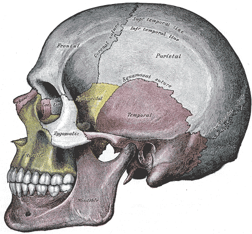

[](https://travis-ci.org/smomni/cranio)
[](https://codecov.io/gh/smomni/cranio)
[](https://cranio.readthedocs.io/en/latest/?badge=latest)
[](https://codeclimate.com/github/smomni/cranio/maintainability)

# cranio

Cranio is a Python package used for force measurements, data analysis and visualization in
posterior calvarial vault osteodistraction (PCVO). PCVO is used to treat patients with craniosynostosis.

Craniosynostosis is a condition occurring in infants where bones in the skull are prematurely fused resulting in
abnormal head shape, decreased intracranial volume (ICV) and increased intracranial pressure (ICP). Fibrous sutures
bones of the skull are prematurely fused by turning into bone. This prevents the skull from growing perpendicular to the
ossified suture which is compensated by increased growth parallel to the fused suture. The features of craniosynostosis
are determined by which sutures are closed. In some case, the resulting growth pattern only leads to abnormal head shape
while leaving enough room for the brain inside the skull. In other cases, in addition to abnormal head shape, intracranial volume is decreased leading to elevated intracranial pressure.
Elevated ICP can cause headache, vomiting, visual impairment (e.g., papilledema), obstructive sleep apnea and
neurobehavioral impairment. Cranisynostosis affects 1/2000 infants and usually occurs as an isolated condition.
In 15% - 40% of cases craniosynostosis is part of a syndrome. Craniosynostosis can be treated with calvarial vault
reconstruction/remodeling (CVR) or posterior calvarial vault osteodistraction (PCVO).




General description on PCVO goes here...

General description on force measurements goes here...


## Getting Started

These instructions will get you a copy of the project up and running on your local machine.

### Hardware

#### External fixator

[KLS Martix Rigid External Fixator (RED)](http://www.klsmartinnorthamerica.com/products/distraction-devices/lefort-i-and-ii/red-ii/) is used as the external fixator.


#### Torque sensor

The craniodistractor measurements are taken with a [Imada HTG2-4](https://imada.com/products/htg2-digital-torque-gauge/) 
digital torque gauge. The gauge features a remote torque sensor with a Jacob's chuck.


### Prerequisites

* OS: Windows, Linux, OS X (tested on Windows 10 and Linux)
* [Python 3.6.x](https://www.python.org/downloads/)
* [git](https://git-scm.com/downloads)

### Installing

The source code is available on [GitHub](https://github.com/smomni/cranio). Install from source using `git` and `pip`:

```bash
git clone https://github.com/smomni/cranio
cd cranio
pip install -e .[test]
```

### Running the tests

Run the test suite using `pytest`:
```bash
pytest
```

### Building the documentation

To build the documentation in HTML format using [Sphinx](http://www.sphinx-doc.org/en/stable/):

```bash
cd docs
make html
```

The built documentation is located in `docs/build/html`.

### Using the software for distraction measurements

To start the measurement software:

```bash
python run.py
```

This will open the main window. Before starting a measurement, you need to do to the following:


1. Connect an Imada HTG2-4 torque sensor from Connect menu
    * NOTE: The serial number of the sensor must match the hard-coded `FTSLQ6QIA`
    * For random-generated dummy measurements, you can connect a dummy torque sensor from the Connect menu
2. Select a patient from the drop-down menu
    * If no patients are listed in the drop-down menu, you need to add one from the File menu in the top left corner of the main window
3. Enter operator name
4. Select distractor number (next to the measurement graph)
5. Click `Start` to start the measurement
6. Rotate the distractor slowly and steadily approximately 1/3 of a full turn and monitors the amount of performed rotation from the holes located in the Jacobs Chuck of the screw driver.
7. Supports the screw driver with your free hand while repositioning the “rotating hand”
8. Repeat steps 6 and 7 until 1 full turn has been performed
9. Release the screw driver from the distractor
10. Click `Stop`
11. Event detection instructions go here...
    

### Data

The distraction meta and raw data are stored locally in a [SQLite](https://www.sqlite.org/index.html) database file `cranio.db`. 
The database file shall be sent to the investigators for data analysis periodically (e.g., daily or weekly) during the treatment.
The database file contains no sensitive patient information as the patient data is pseudonymized.


## Acknowledgments

* Ritvanen, A., et al. "Force measurements during posterior calvarial vault osteodistraction: A novel measurement method." Journal of Cranio-Maxillofacial Surgery 45.6 (2017): 981-989.

